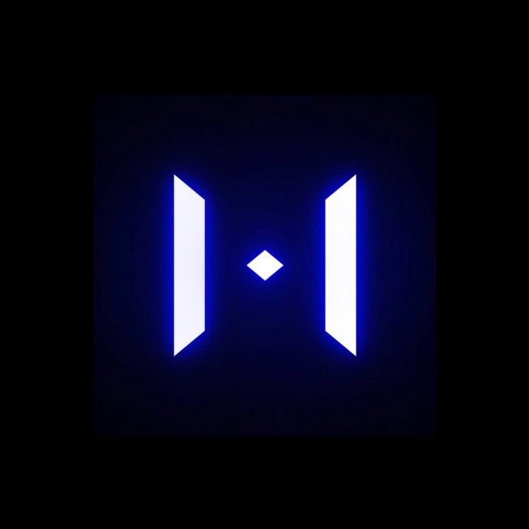
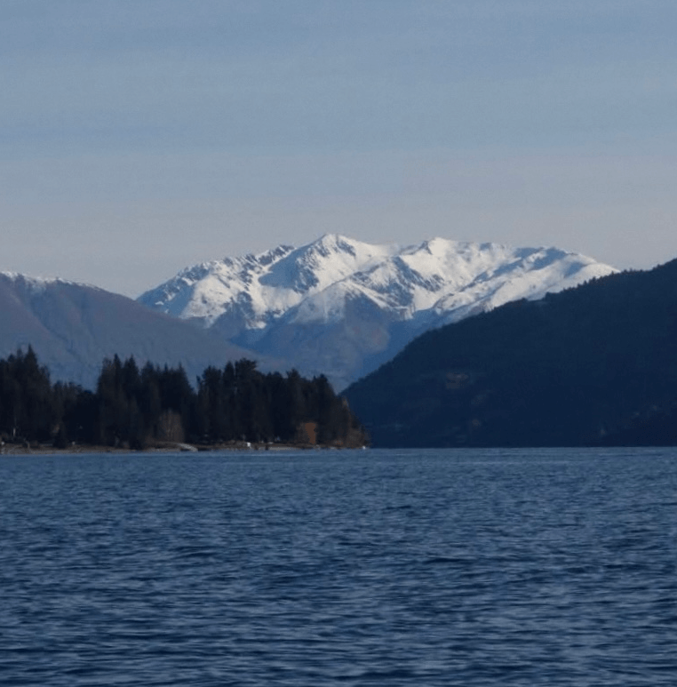
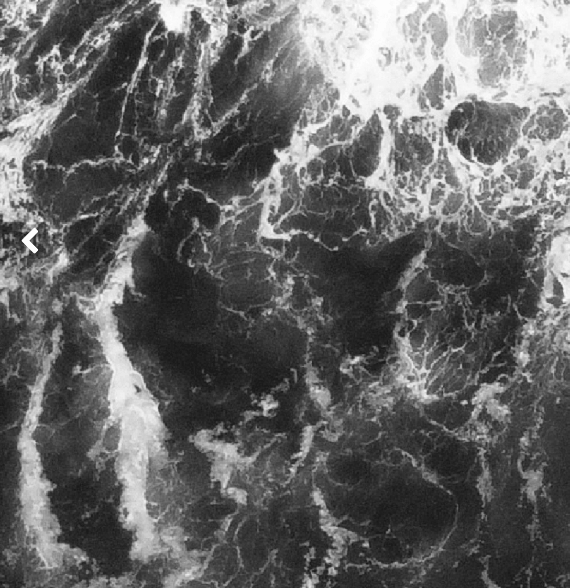

  <h2>👋 Hola, soy Jalko</h2>
  
<strong>Bio-Land Artist & Full Stack Developer</strong> | Founder at Zenergia

  
Uniendo software, biotecnología aplicada y diseño para transformar la bioeconomía y crear autonomía creativa.

 

  <h3>Proyectos Destacados</h3>

<table>
  <tr>
    <td align="center">
      
       
      <strong>kroxtrain</strong>
    </td>
    <td align="center">
      
       
      <strong>nzTrip</strong>
    </td>
    <td align="center">
      
       
      <strong>overTsea</strong>
    </td>
  </tr>
</table>

 

  <h3>Conectemos y conozcamos más</h3>
  
Visita nuestro ecosistema en <a href="https://zenergia.world">zenergia.world</a>.

